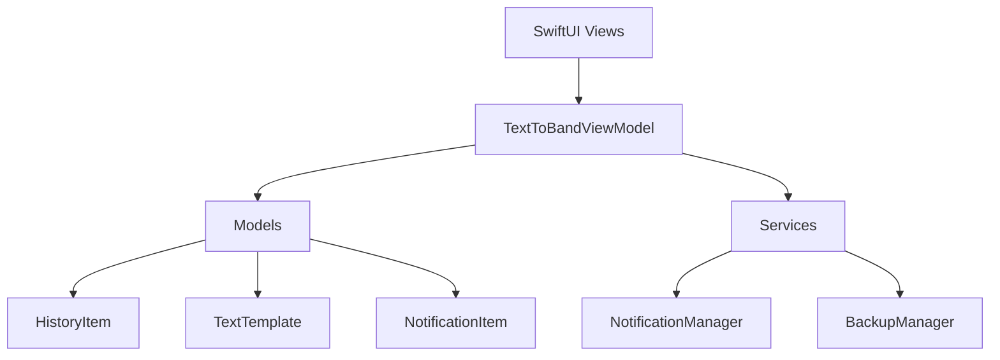

# 📱 TextToBand - iOS App

<div align="center">
  
  
  
  
</div>

<p align="center">
  <strong>Умное iOS приложение для разбивки текста на уведомления для Mi Band и других смарт-устройств</strong>
</p>

<div align="center">
  
</div>

## ✨ Основные возможности

| Функция | Описание |
|---------|----------|
| 📝 **Умная разбивка текста** | Автоматическое разделение длинного текста на части до 240 символов |
| 🔔 **Гибкие уведомления** | Отправка локальных уведомлений с настраиваемыми интервалами |
| 📚 **История отправок** | Сохранение и повторное использование отправленных текстов |
| 📋 **Шаблоны текстов** | Создание и управление часто используемыми шаблонами |
| ⚙️ **Настройки** | Гибкая конфигурация размера частей, интервалов и звука |
| 💾 **Экспорт/Импорт** | Резервное копирование и восстановление всех данных |
| 🎨 **Современный дизайн** | Фиолетовый акцентный цвет с поддержкой тёмной темы |

## 🏗️ Архитектура

Приложение построено с использованием современных подходов iOS разработки:



### Технологический стек:
- **UI Framework**: SwiftUI с MVVM архитектурой
- **Notifications**: UNUserNotificationCenter для локальных уведомлений
- **Storage**: UserDefaults + JSON для персистентности данных
- **Settings**: Settings Bundle для системной интеграции
- **Testing**: XCTest для Unit и UI тестирования

## 📁 Структура проекта

```
TextToBand/
├── 📱 Views/              # SwiftUI пользовательский интерфейс
│   ├── ContentView.swift      # Главный экран приложения
│   ├── HistoryView.swift      # Экран истории отправок
│   ├── TemplatesView.swift    # Управление шаблонами
│   └── SettingsView.swift     # Экран настроек
├── 🧠 ViewModels/         # Бизнес-логика MVVM
│   └── TextToBandViewModel.swift
├── 📊 Models/             # Модели данных
│   ├── HistoryItem.swift      # Элемент истории
│   ├── TextTemplate.swift     # Шаблон текста
│   ├── NotificationItem.swift # Элемент уведомления
│   └── AppSettings.swift      # Настройки приложения
├── 🔧 Services/           # Внешние сервисы
│   ├── NotificationManager.swift # Управление уведомлениями
│   └── BackupManager.swift       # Экспорт/импорт данных
├── 🧩 Components/         # Переиспользуемые компоненты
│   └── NotificationCard.swift
└── 🧪 Tests/              # Тесты
    ├── TextToBandTests/       # Unit тесты
    └── TextToBandUITests/     # UI тесты
```

## 🧪 Тестирование

Проект включает комплексное покрытие тестами:

### Unit Tests (6 файлов)
- ✅ `TextToBandViewModelTests` - Основная бизнес-логика
- ✅ `HistoryItemTests` - Валидация моделей данных
- ✅ `TextTemplateTests` - Управление шаблонами
- ✅ `NotificationManagerTests` - Локальные уведомления
- ✅ `BackupManagerTests` - Функциональность экспорт/импорт
- ✅ `BasicTests` - Базовые операции

### UI Tests
- ✅ `TextToBandUITests` - Автоматизированное тестирование интерфейса

## 🚀 Быстрый старт

### Требования
- **macOS**: 14.0+ (Sonoma)
- **Xcode**: 16.0+
- **iOS**: 18.5+
- **Swift**: 5.9+

### Установка

1. **Клонирование репозитория**
   ```bash
   git clone https://github.com/yourusername/TextToBand.git
   cd TextToBand
   ```

2. **Открытие проекта**
   ```bash
   open TextToBand.xcodeproj
   ```

3. **Сборка и запуск**
   - Выберите целевой симулятор iPhone
   - Нажмите `Cmd + R` или кнопку ▶️ Play

### Сборка из командной строки

```bash
# Сборка проекта
xcodebuild -scheme TextToBand -destination 'platform=iOS Simulator,name=iPhone 16' build

# Запуск тестов
xcodebuild -scheme TextToBand -destination 'platform=iOS Simulator,name=iPhone 16' test

# Установка в симулятор
xcodebuild -scheme TextToBand -destination 'platform=iOS Simulator,name=iPhone 16' install
```

## 📖 Использование

### Основной workflow:

1. **💬 Ввод текста**
   - Введите длинный текст в текстовое поле
   - Приложение автоматически покажет количество символов и будущих уведомлений

2. **✂️ Разбивка**
   - Нажмите "Разбить текст" для создания частей по 240 символов
   - Текст умно разделяется по границам предложений

3. **📤 Отправка**
   - "Отправить сейчас" - немедленная отправка с интервалами
   - "Отправить через" - запланированная отправка на определённое время

4. **⚙️ Настройки**
   - Размер части текста (50-300 символов)
   - Интервал между уведомлениями (1-60 секунд)
   - Включение/выключение звука

5. **📋 Шаблоны**
   - Создавайте шаблоны для часто используемых текстов
   - Быстрая вставка одним нажатием

6. **📚 История**
   - Просматривайте все отправленные тексты
   - Повторная отправка с одним нажатием
   - Статусы: Черновик → В очереди → Отправка → Отправлено

7. **💾 Резервное копирование**
   - Экспорт всех данных в JSON файл
   - Импорт для восстановления на новом устройстве

## 🤝 Вклад в проект

Мы приветствуем вклад сообщества! Вот как вы можете помочь:

1. **🍴 Fork** репозитория
2. **🌿 Создайте** ветку для новой функции (`git checkout -b feature/AmazingFeature`)
3. **💾 Commit** изменения (`git commit -m 'Add some AmazingFeature'`)
4. **📤 Push** в ветку (`git push origin feature/AmazingFeature`)
5. **🔄 Откройте** Pull Request

### Типы вкладов:
- 🐛 Исправление багов
- ✨ Новые функции
- 📚 Улучшение документации
- 🧪 Добавление тестов
- 🎨 Улучшение UI/UX
- 🌍 Локализация

## 📄 Лицензия

Этот проект распространяется под лицензией MIT. См. файл [LICENSE](LICENSE) для подробностей.

## 👨‍💻 Автор

Создано с ❤️ для пользователей Mi Band и других смарт-устройств.

## 🙏 Благодарности

- Apple за превосходные инструменты разработки
- SwiftUI сообщество за вдохновение
- Mi Band пользователи за обратную связь

---

<div align="center">
  <p>⭐ Поставьте звезду, если проект был полезен!</p>
</div>
